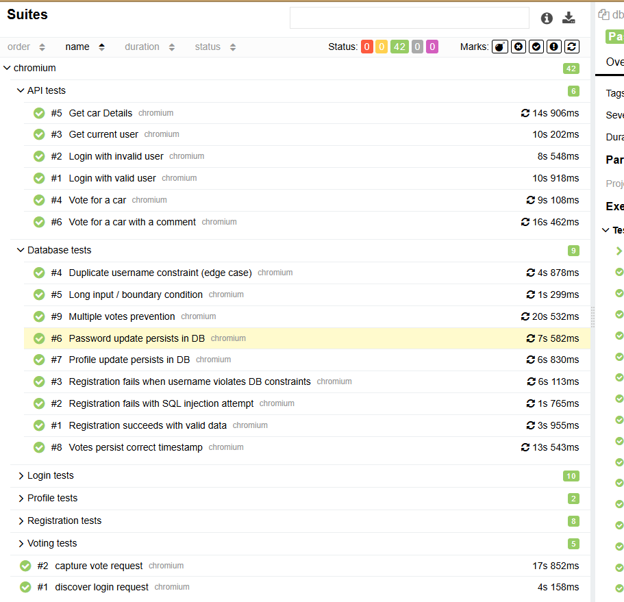

[](https://github.com/SeenBetterDes/PlaywrightCarProjectJS/actions/workflows/playwright.yml)

# Playwright test Automation Project : JavaScript + Node.js

# Overview
 Welcome to my portfolio project! This is an automated testing framework built for the [Buggy Cars Rating](https://buggy.justtestit.org/) website.
 The project is built with Playwright, SQL, Node.js and Allure in order to cover different testing scenarios including User registration, Updating credentials, Voting and Backend tests.
 
The project comes equipped with its own ``PlaywrightProject.xlsx`` Excel file, providing test documentation and mirroring realistic test suites.
The actual structure follows Hybrid Automation Framework style, integrating Page Object Model(POM) to correctly find and perform operations of different elements.

This project integrates:
- Playwright for browser automation
- MySQL for database-driven validation and persistence checks
- Playwright’s APIRequestContext for REST API testing
- Allure Reports for interactive reporting
- Excel test plan (``PlaywrightProject.xlsx``) to mirror real-world QA documentation
- GitHub Actions for CI/CD integration

## Key Highlights:

- **Full-stack automation → UI + API + DB**
- **Page Object Model (POM) for structured UI interactions**
- **Hybrid Framework combining data-driven, functional, and integration tests**
- **Database Integrity tests → SQL injection, constraint checks, persistence validation**
- **REST API tests → Auth, user management, car details, voting**
- **Allure reporting with custom labels, tags, and severity levels**
- **CI via GitHub Actions**

## Project Structure 

```cars_project/
├── .github/                     # CI/CD workflows
├── allure-report/               # Generated Allure HTML report
├── allure-results/              # Raw results for Allure
├── docs/                        # Documentation & supporting files
│   ├── PlaywrightProject.xlsx   # Excel test plan
│   ├── schema_with_data.sql     # Initial DB schema and data
│   └── allure-report-picture.png # Screenshot of Allure report
├── node_modules/                # Installed dependencies
├── playwright-report/           # Playwright HTML reports
├── src/
│   ├── pages/                   # Page Object Model (POM) classes
│   └── utils/                   # Helper functions
│       ├── apiHelper.js
│       └── dbHelper.js
├── tests/
│   ├── api/                     # API test files
│   │   └── apiTests.spec.js
│   ├── capture/                 # Screenshot & visual validation tests
│   │   ├── capture-login.spec.js
│   │   └── capture-vote.spec.js
│   ├── db/                      # Database test files
│   │   └── database.spec.js
│   └── ui/                      # UI test files
│       ├── login.spec.js
│       ├── profile.spec.js
│       ├── register.spec.js
│       └── voting.spec.js
├── test-results/                # Test result outputs
├── tmp/                         # Temporary runtime files
├── .env                         # Local environment variables (ignored in Git)
├── .env.example                 # Template for environment variables
├── .gitignore
├── package.json                 # Dependencies & scripts
├── package-lock.json
├── playwright.config.js          # Playwright configuration
├── README.md
├── results.json                 # Optional: test results output
└── results.xml                  # Optional: test results output in XML
```


## Test Case Categories
The initial ~40 automated tests are designed to validate both visual and functional aspects of the Buggy Cars Rating application.

They span across UI, API, and Database layers, ensuring end-to-end coverage of core features such as Registration, Login, Profile Management, and Voting.

**UI Tests**
- Registration flow
- Profile updates (first name, password, etc.)
- Login (valid, invalid, locked-out, edge cases)
- Voting functionality

**API Tests**
- Login via API (positive & negative)
- Fetching current user
- Retrieve car details
- Submit votes (with/without comments)

**Database Tests** 

- Registration persists in DB
- SQL injection prevention
- DB constraints (duplicate usernames, invalid formats)
- Prevention of multiple votes

**Capture Tests**
- UI screenshot and visual debugging on failures


# Setup Instructions

## 1. Clone the repository:

```git clone https://github.com/your-username/cars_project.git```

```cd cars_project```

## 2. Install dependencies

- ``npm install`` 

   package.json will install all dependencies

### 3. Database Setup

- Create a schema

- Configure DB connection in src/utils/dbHelper.js (update host, user, password, database).

- Import initial schema & tables (SQL script provided in /docs).

- Run the command: ``mysql -u $DB_USER -p $DB_NAME < docs/schema_with_data.sql``

  Replace ``$DB_USER``  and ``$DB_NAME`` with your local credentials

## 4. Run the tests

- Run all tests (UI + API + DB): 

  ``npm test``
- Run in headed mode: 

  ``npm run test:headed``
- Run in UI mode (interactive): 

  ``npm run test:ui``
- Run only API tests: 

  ``npx playwright test tests/api``

- Run only DB tests: 

  ``npx playwright test tests/db``

- Run only UI tests: 

  ``npx playwright test tests/ui``

## 5. Post-Test Reporting
After running tests, review results using:

- Show default Playwright report: 

  ``npx playwright show-report``
- Generate Allure report: 

  ``npm run allure:report``


# Tools and Technologies

The project uses various tools in order to ensure a realistic test suite used in real life projects.

- Node.js 18+
- Playwright (@playwright/test)
- Allure Playwright
- MySQL2 (DB testing & persistence)
- Excel (PlaywrightProject.xlsx) for test documentation
- Github Actions 

# Reporting

This project includes HTML reporting functionality via Playwright and Allure.



Screenshots and logs for failed tests can be captured and included in Allure reports for easier debugging.


## Future Improvements

I plan to expand test coverage for the core application functionality, include more data-driven scenarios, and add additional edge-case tests to make the test suites closer to real-world QA practices.

Because the site does not expose its API endpoints, it is quite tough to perform realistic security testing —a topic I am particularly interested in advancing further.

Future road-map includes:
1. Advancing API and Security testing
2. Adding more tests to current playwright project
3. Improving reporting and CI/CD integration for better visibility and automation insights.
4. Exploring Cypress for cross-tool knowledge

Thank you for reading and being interested in my project! It means a world to me.

Check out my other project at: https://github.com/SeenBetterDes/SauceDemoQA


**Note: This project is intended as a personal portfolio showcase.**
This project is licensed under the [MIT License](LICENSE).
